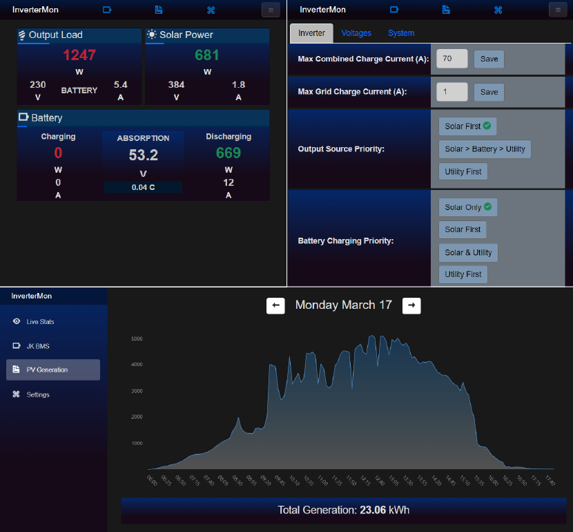
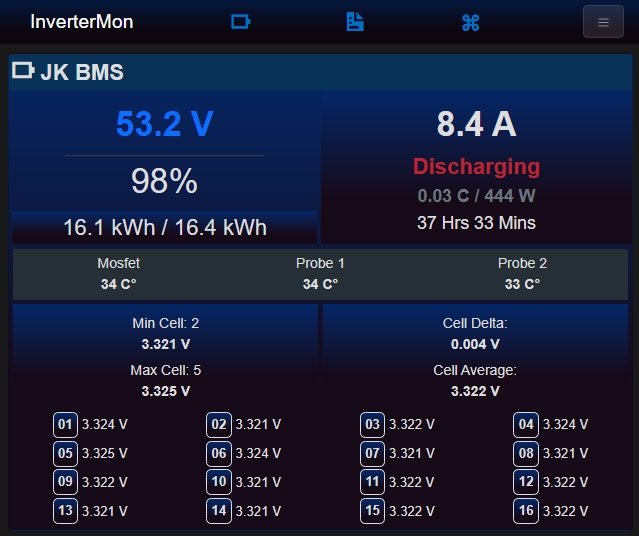

# FelicitySolar Inverter Monitor



---

This application allows you to monitor Felicity inverters in realtime via a [RJ45 to USB cable](https://www.aliexpress.com/item/1005007504153777.html) as an alternative to the wifi module and cloud based apps.

For this to work, you need to connect a computer such as a Raspberry/Orange Pi or any other computer (Linux or Windows) to the inverter via USB port to the inverters RJ45 port marked RS232 which is typically on the left next to the BMS port. This application has not been tested on MacOS but might work if you can figure out the correct drivers and port names.

Once your inverter is connected via data cable, a new device should appear on Linux at `/dev/ttyUSBX` or `COMX` in Windows. Open up the `appsettings.json` file and make sure the `DeviceAddress` setting correctly points to your USB device such as `/dev/ttyUSB1` or `COM1`.

After the correct USB device path is setup, all you have to do is execute the `InverterMon.Server` executable. The binaries can be downloaded from the [releases section](https://github.com/dj-nitehawk/Felicity-Inverter-Monitor/releases). Make sure to choose the correct architecture (x64/arm) for your machine.

After the application has started successfully, you can simply open up a web browser and navigate to `http://ip.address.of.machine` or `http://localhost` if the app is running in the same machine as your web browser, to see the dashboard. It may take up to 5 seconds for the data to show up initially.

If you have a firewall, please open port `80` to facilitate communication, pr change the port in the `appsettings.json` file.

In order to make the application/server automatically start at boot in Linux, follow the below procedure to create a `systemd` service.

# Auto Start Configuration Steps

open the following file (or the correct one for your OS):

`sudo nano /lib/udev/rules.d/99-systemd.rules`

add the following text to the end:
```
KERNEL=="ttyUSB1", SYMLINK="ttyUSB1", TAG+="systemd"
```

create a new file for the service

`sudo nano /etc/systemd/system/invertermon.service`

copy/paste the following:
```ini
[Unit]
Description=Felicity Inverter Monitor

#change here if device is hidraw
After=dev-ttyUSB1.device

[Service]
Type=simple
User=root
Group=root
UMask=000

#put the downloaded files in here
WorkingDirectory=/inverter
ExecStart=/inverter/InverterMon.Server

Restart=always
RestartSec=30

[Install]
WantedBy=multi-user.target
```
run the following commands to enable and start the service:
```
sudo systemctl enable invertermon
sudo systemctl start invertermon
sudo systemctl status invertermon
```
restart the machine to check if the service was configured correctly.

# JK BMS Support
If you have a JK BMS + JK RS485 adapter + USB->TTL adapter, simply wire them up correctly and plug it in to the computer. 
The app will try to connect to the BMS via serial port by default at address `/dev/ttyUSB0`. 
If your USB->TTL device is mounted at a different device path, simply update the `appsettings.json` file with the correct path like so:
```json
{
  "LaunchSettings": {
    "JkBmsAddress": "/dev/ttyUSB1"
  }
}
```

