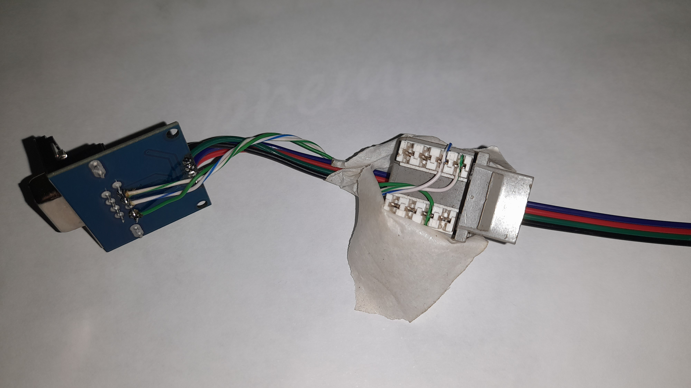
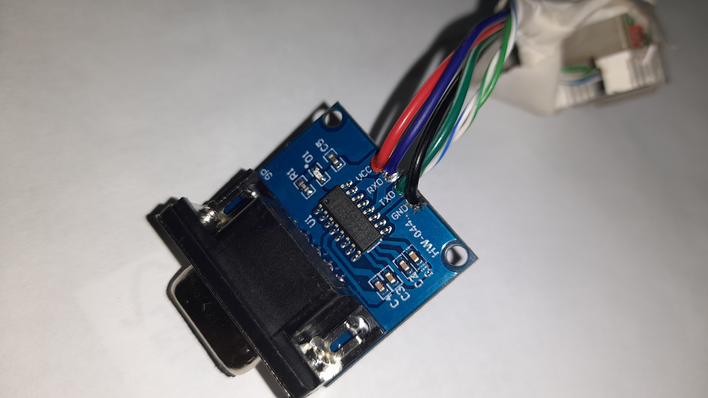
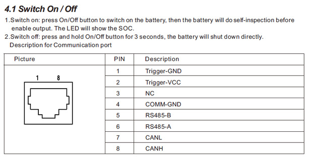

#extra files

start
inverter
batery
# Obrigado.
# FelicitySolar Inverter Monitor

---

This application allows you to monitor Felicity inverters in realtime via a serial to  ttl com o cabo incluso no kit atualmente em implementação de db9 as an alternative to the wifi module and cloud based apps.

identificação do pinos em rs232 rj45 out pins out  google help, tnks.
cabo rs232 saida inversor rj45 to db9 femea meu conversosr femea tmb make new cable rj45 in original cable uses 
4 wires 

RJ45
1 laranja  
2 laranja branco 
3 verdebranco 
8 verde 

Db9
1 no use
2 
3 
4 no use
5 to 8
9 to 3

Fio no RJ45 (Inversor)Sinal no InversorConexão no DB9 Macho

Pino 1TXPino 2 (RXD)or txPino 2RXPino 3 (TXD)or rxPino 3RI pino 9Pino 8gndpino 5 gndgnd



Certo, entendi! Você está me dando a pinagem que você identificou (ou deduziu) do seu inversor e como gostaria de conectá-la a um DB9 macho.

Com base nas informações que você forneceu, vamos organizar e confirmar a pinagem para o seu cabo.

Montagem do Cabo: RJ45 (Inversor) para DB9 Macho (para seu Conversor Fêmea)
Considerando a sua proposta de pinagem e as convenções padrão RS232:

Fio no RJ45 (Inversor)	Sinal Identificado no Inversor	Conexão no DB9 Macho
Pino 1 (Laranja)	TX (Transmite Dados)	Pino 2 (RXD)
Pino 2 (Laranja-Branco)	RX (Recebe Dados)	Pino 3 (TXD)
Pino 3 (Verde-Branco)	RI (Ring Indicator)	Pino 9 (RI)
Pino 8 (Verde)	GND (Terra)	Pino 5 (GND)

Exportar para as Planilhas
Explicação da Conexão:
TX (RJ45 Pino 1) para RXD (DB9 Pino 2): Esta é a conexão cruzada essencial para a comunicação serial. O sinal de transmissão (TX) do inversor precisa ir para o pino de recepção (RXD) do seu conversor (que espera receber dados).

RX (RJ45 Pino 2) para TXD (DB9 Pino 3): Da mesma forma, o sinal de recepção (RX) do inversor precisa receber dados do pino de transmissão (TXD) do seu conversor.

GND (RJ45 Pino 8) para GND (DB9 Pino 5): O terra (GND) é fundamental para estabelecer uma referência de tensão comum entre os dois dispositivos. É crucial que o GND seja conectado corretamente para que os sinais de dados possam ser interpretados.

RI (RJ45 Pino 3) para RI (DB9 Pino 9): O sinal "Ring Indicator" (RI) é menos comum para comunicação de dados pura, sendo mais usado em modems para indicar uma chamada recebida. Se o inversor realmente usa este pino como RI e seu conversor o espera, então a conexão ao Pino 9 do DB9 (que é o pino padrão para RI) está correta. Se você não tem certeza da função "RI" para o inversor, ou se não for um sinal essencial para a comunicação de dados, você pode até omitir essa conexão. O mais importante para dados são TX, RX e GND.

Verificação Final e Recomendações:
Confirmação do Manual: Reforço a importância de confirmar a pinagem no manual do seu inversor. As cores dos fios que você mencionou (laranja, laranja-branco, verde-branco, verde) são comuns em cabos de rede Ethernet, mas a atribuição de TX/RX/GND a esses pinos RJ45 para RS232 pode variar drasticamente entre fabricantes. Se o manual divergir, siga o manual.

Crimpagem RJ45: Certifique-se de que a crimpagem do conector RJ45 seja feita de forma limpa e que os fios estejam nas posições corretas (1, 2, 3 e 8) dentro do conector.

Solda DB9: Ao soldar o DB9 macho, certifique-se de que as soldas sejam firmes e que não haja curtos entre os pinos.

Teste de Continuidade: Se possível, após montar o cabo, use um multímetro para testar a continuidade entre os pinos correspondentes de cada ponta para garantir que não haja interrupções ou curtos.

Esta configuração do cabo deve permitir a comunicação RS232 entre seu inversor e o conversor, assumindo que as funções de cada pino no RJ45 do inversor estão realmente como você as descreveu. 😊

"TNKS gemini"

wiring new conector 

data from battery rs485 or canbus i try to get data from all, 
 
cable incluso with pinnames canbus and 485 triger power ? 12v.? how amp drain, 

esphome or pihome and hole and...

power esp usb charger
esphome espmodule serial ttl 
extras 
relês to very low draim or to power ssr 
led
sensors 
extras pins

power bbtpiv1.2, 12v 2 amp or more max 25v or 5v 3 amp charger
bttpiv1.2 pihome serial ttl rs485 canbus 
extras
servers pihole 
usb ports
can bus port
led
sensors 
extras pins

https://github.com/slipx06/Sunsynk-Home-Assistant-Dash

https://github.com/nygma2004/growatt2mqtt

https://github.com/volkszaehler/mbmd

https://github.com/OpenInverterGateway/OpenInverterGateway/tree/master
https://github.com/fboundy/ha_solis_modbus

https://github.com/sebastianheyn/felicityess2mqtt
https://github.com/DM6JM/FelicityConverter
https://github.com/seb-spec/dbus-serialBattery-FelicityESS
https://github.com/mfischer-ffb/Felicity_ESP32/blob/main/Felicity_ESP32.ino
https://github.com/tgfuellner/Esphome-FelicityESS

